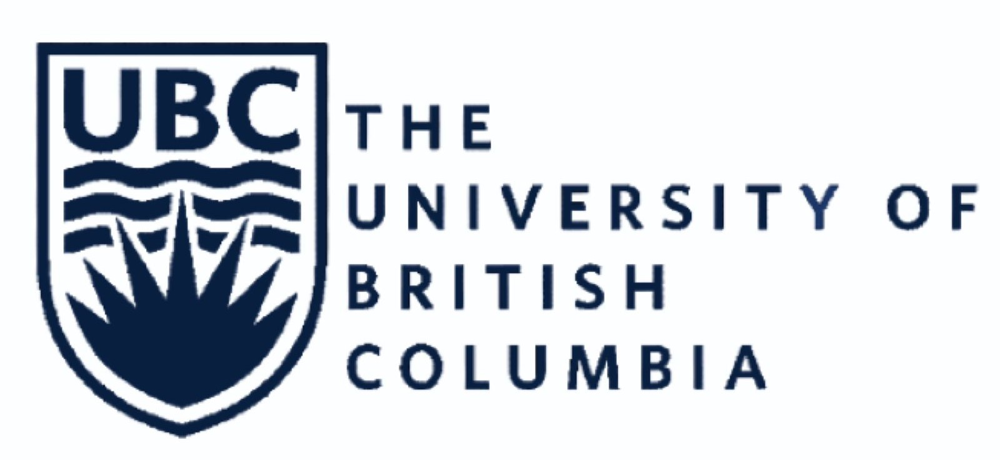

Born and raised in Mexico, with degrees from Mexico, Italy, United Kingdom, and Canada in diverse fields. Passionate about playing drums, listening to live music, outdoor activities and travelling.

I hold an **MSc in Mechanical Engineering from University College London**, graduating with honors, and a **Master's in Data Science at the University of British Columbia in Vancouver, BC**. Through my studies, I have developed expertise in **machine learning, regression analysis, and advanced statistics**.

I am eager to leverage both my engineering background and emerging data science skills, and to utilize **data-driven approaches to solve complex challenges** in diverse fields, from engineering to sports, gaming, entertainment, business and beyond. I’m excited about the opportunity to apply my experience in engineering leadership and my new capabilities to drive innovation, growth and efficiency.

As an **engineer** with over **10 years of experience** in the aerospace industry, I have specialized in the development of advanced aircraft engine and gas turbine technologies, with a focus on **performance optimization and thermodynamic modeling**.

In addition to my technical expertise, I bring significant **people and project management experience**, having led cross-functional and international teams. I am passionate about building, coaching, and mentoring team members, ensuring not only the successful completion of projects but also the growth and development of individuals within the team. My leadership style is focused on fostering collaboration, innovation, and a high-performance culture.

## WORK HISTORY

### SENIOR PERFORMANCE ENGINEERING MANAGER
#### 09/2022 to 08/2024
#### **GE Aerospace**

•	Led performance development, administration, and resource allocation for the [LM9000](https://www.bakerhughes.com/gas-turbines/aeroderivative-technology/lm9000-aeroderivative-gas-turbine) gas turbine product, while supporting all Marine and Industrial aeroderivative applications, resulting in optimized performance, transient analysis, and operability.

<iframe width="560" height="315" src="https://www.youtube.com/embed/mg8ZuQHJ-z8?si=skwZ7xt4vH000Qqs" title="YouTube video player" frameborder="0" allow="accelerometer; autoplay; clipboard-write; encrypted-media; gyroscope; picture-in-picture; web-share" referrerpolicy="strict-origin-when-cross-origin" allowfullscreen></iframe>

•	Devised and implemented strategic technical plans for projects, effectively aligning customer needs and business goals in terms of budget, schedule, and CTQs.

•	Cultivated a high-performance team of 9 engineers, overseeing talent acquisition, career development, and coaching initiatives.

•	Coordinated a diverse engineering team across six countries (Mexico, United States, Poland, Turkey, India, Italy), fostering global collaboration and driving successful prototype testing project outcomes.

### PERFORMANCE PROGRAM LEADER
#### 03/2020 to 09/2022 
#### **GE Aerospace**

•	Successfully supported the market introduction of the LM9000 product with high-profile clients such as Petronas, Novatek, and Commonwealth in collaboration with Baker Hughes.

•	Created a proficient team capable of supporting the LM9000 platform in Performance, Transient Analysis, and Operability.

•	Effectively transferred roles of five engineers from the USA to Mexico, while building and developing a dedicated support team in Mexico for the LM9000 platform.

•	Conducted detailed technical audits and reviews prior to product field entry, ensuring optimal performance and adherence to quality standards.

### LEAD PERFORMANCE ENGINEER
#### 10/2015 to 03/2020 
#### **GE Aviation**

•	Provided pivotal support and analysis to a three-month onsite prototype test for the LM9000 in Massa, Italy.

•	Developed thermodynamic models in NPSS (C++ based) for the simulation of the new product, LM9000, enabling accurate performance prediction and aiding in product development.

•	Conducted comprehensive customer interactions and data-driven performance diagnostics, improving problem-solving capacity, and fostering positive customer relationships.

### PERFORMANCE ENGINEER 
#### 11/2011 to 01/2014 
#### **GE Aviation**

•	Honored with the internal GE Aviation Engineering Recognition Award (ERD) for the development of statistical tools that significantly improved overhaul shops and field support.

•	Provided crucial support to test cells in over five countries for the CFM56 and GE90 engine lines.

•	Conducted thorough performance diagnostics of engines based on thermodynamic and statistical analysis.

## EDUCATION

### University of British Columbia | Master of Data Science
#### Vancouver, BC | 2025

•	Relevant Courses in Supervised and Unsupervised Learning, Regression Modeling, Statistical Inference, Spatial and Temporal Modeling, Databases, Data Visualization, Software Development, Web and Cloud Computing.

### University College London | Master of Science in Mechanical Engineering 
#### London, UK | 2015

•	Major: Applied Thermodynamics and Turbomachinery

•	Awards: Distinction and Dean's List for Outstanding Academic Performance

•	CONACYT Scholarship Recipient

### ITESM | Bachelor of Science in Mechanical Engineering and Management
#### Queretaro, Mexico | 2011

•	Certificate in Aeronautics awarded by Tecnologico de Monterrey and Politecnico di Torino

•	Exchange program at Politecnico di Torino in Italy focused on Aerospace Engineering courses

## SKILLS
### Data Science
##### Programming and Tools
•	Python (Pandas, NumPy, Pytorch), R (tidyverse), SQL, Git, Bash, Docker, GitHub Workflows

##### Data Engineering
•	Relational databases, SQL (PostgreSQL), MongoDB, Web & Cloud Computing

##### Machine Learning
•	Supervised Machine Learning Modeling: Neural Networks, SVMs, KNN, Decision Trees, Random Forests, Feature Engineering

•	Unsupervised Machine Learning Modeling: Clustering, Recommendation Systems, Topic Modeling

•	Temporal and Spatial Modeling

##### Probability and Statistics
•	Descriptive and Inferential Statistics, Hypothesis Testing

•	Frequentist and Bayesian regression analysis

•	Causal Inference - A/B Testing

##### Visualization
•	Altair, ggplot2, Matplotlib, Plotly

•	Dashboards - Dash and Shiny

### Engineering
•	Advanced Gas Turbine Performance Engineering 

•	Thermodynamic Modelling in NPSS (C++ based) 

•	Engine Development Planning, Modeling, Testing, Analysis 

•	Statistical Analysis with Minitab

•	Advanced Thermodynamics & Fluid Mechanics

### Management
•	Project Management (PMI Training)

•	Strategy Definition and Execution of Technical Deliverables 

•	International, Cross-Cultural Team Leadership and Development

•	Risk Management and Resource Allocation

•	Customer Relationship Management and Support

