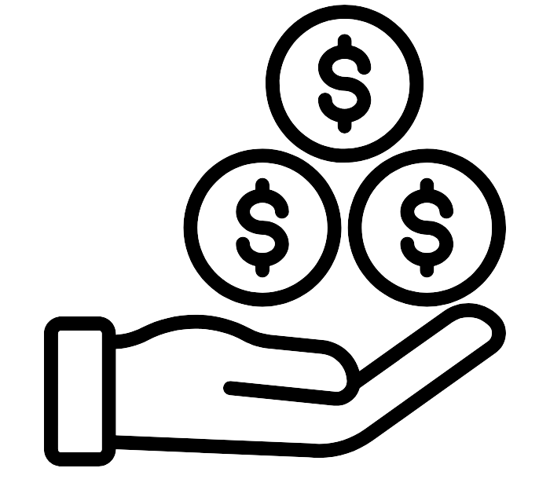

:::{.grid-container}

  
  <h3>Commuting Insights</h3>
  

<strong>UBC MDS Collaborators</strong>: Eugene You (@jinxyou), Derek Rodgers (@derekrodgers), Han Wang (@hanwang205)

<strong>Keys</strong>: Dash, Altair, Render.com, Python, Parquet

<strong>Summary</strong>: The dashboard visualizes various aspects of commuting behavior across Canada, including transportation modes, average commute times, and regional dependencies on specific means of transport. The goal being to inform policies that can lead to better, more sustainable commuting solutions across the country.

  <a href="https://dsci-532-2025-28-commuting-insights.onrender.com/" class="btn btn-outline-dark">Dashboard</a>
  <a href="https://github.com/UBC-MDS/DSCI-532_2025_28_commuting-insights" class="btn btn-outline-dark">Github</a>

  
  <h3>py_atmosphere Package</h3>
  

<strong>UBC MDS Collaborators</strong>: Zhengling Jiang (@ClaireJ2100), Tianjiao Jiang (@tianjiao00).

<strong>Keys</strong>: poetry, cookiecutter, Python, pandas, pytest, Github Workflows, Continuous Development and Integration

<strong>Summary</strong>: This package contains the simplified [NASA's GRC Earth Atmospheric model](https://www.grc.nasa.gov/www/k-12/airplane/atmos.html) and calculates atmospheric air properties for an altitude of interest, and supports Mach number calculation for a moving object in space at the same altitude. In the context of aerospace engineering, a Standard Atmosphere model allows to measure air properties impact on aircraft operation.

  <a href="https://pypi.org/project/py-atmosphere-mach/" class="btn btn-outline-dark">PyPi Package</a>
  <a href="https://github.com/UBC-MDS/DSCI-532_2025_28_commuting-insights" class="btn btn-outline-dark">Github</a>

  
  <h3>Adult Income Predictor</h3>
  
 
<strong>UBC MDS Collaborators</strong>: Michael Suriawan (@mikem2m), Quanhua Huang (@QuanhuaHuang-ubc), Tingting Chen (@Calista321).

<strong>Keys</strong>: Make, Docker, Python, pandas, pytest, pandera, KNN Classifier

<strong>Summary</strong>: Application of a K-Nearest Neighbors (KNN) Classifier to predict an individual's annual income based on selected categorical socioeconomic features Using the [Adult Dataset](https://archive.ics.uci.edu/dataset/2/adult). The model achieved an accuracy of approximately 80%. This result emphasizes the importance of socioeconomic factors in determining income levels.

  <a href="img/adult_income.html" class="btn btn-outline-dark">Analysis</a>
  <a href="https://github.com/UBC-MDS/DSCI522-2425-group24_adult-income-predictor" class="btn btn-outline-dark">Github</a>

  
  <h3>Data Science in Music Streaming</h3>
  

<strong>Keys</strong>: Quarto, Recommendation Systems

<strong>Summary</strong>: This blog post was developed as part of UBC's Master of Data Science program. This post discusses how the use of data and machine learning on platforms like Spotify, Apple Music, and YouTube Music have changed not just how we consume music, but how we discover it. This post is an introductory read on how recommendation systems customize the music listening experience.

  <a href="https://fraramfra.github.io/UBC_542_Week2_Blog/posts/542_DataScienceInMusicStreaming/" class="btn btn-outline-dark">Blog Post</a>
  <a href="https://github.com/fraramfra/UBC_542_Week2_Blog" class="btn btn-outline-dark">Github</a>

:::

Pin by Denicon from <a href="https://thenounproject.com/browse/icons/term/pin/" target="_blank" title="Pin Icons">Noun Project</a> (CC BY 3.0)

Music by Lula Sugiantoro from <a href="https://thenounproject.com/browse/icons/term/music/" target="_blank" title="Music Icons">Noun Project</a> (CC BY 3.0)

Income by nuha from <a href="https://thenounproject.com/browse/icons/term/income/" target="_blank" title="Income Icons">Noun Project</a> (CC BY 3.0)

Airplane by Ales Studio from <a href="https://thenounproject.com/browse/icons/term/airplane/" target="_blank" title="Airplane Icons">Noun Project</a> (CC BY 3.0)
