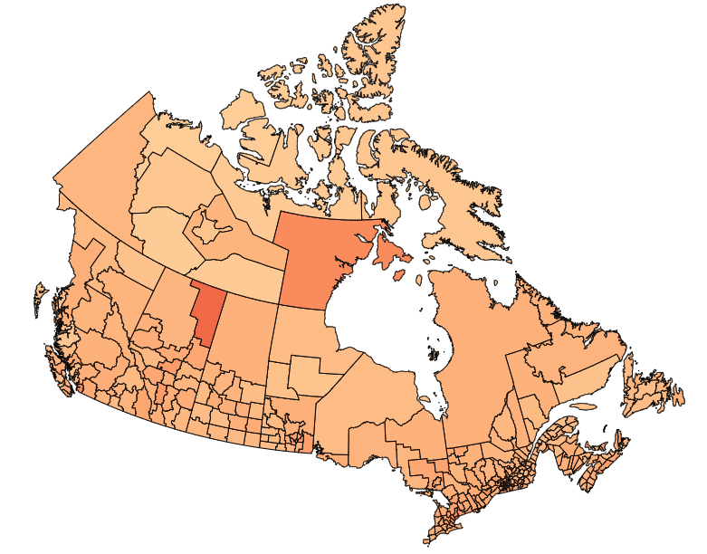

:::{.grid-container}

  
  <h3>Commuting Insights</h3>
  
"Commuting Insights" is a dashboard developed in Dash in collaboration with Eugene You (@jinxyou), Derek Rodgers (@derekrodgers) and Han Wang (@hanwang205), as part of UBC's Master of Data Science program.

This project aimed to provide actionable insights to help shape Canada’s future transportation policies. The dashboard visualizes various aspects of commuting behavior across Canada, including transportation modes, average commute times, and regional dependencies on specific means of transport. The ultimate goal is to inform policies that can lead to better, more sustainable commuting solutions across the country.

  <a href="https://dsci-532-2025-28-commuting-insights.onrender.com/" class="btn btn-outline-dark">Dashboard</a>
  <a href="https://github.com/UBC-MDS/DSCI-532_2025_28_commuting-insights" class="btn btn-outline-dark">Github</a>

  
  <h3>py_atmosphere Package</h3>
  
"py_atmosphere" is a Python package developed in collaboration with Zhengling Jiang (@ClaireJ2100) and Tianjiao Jiang (@tianjiao00), as part of UBC's Master of Data Science program.

This package contains the simplified [NASA's GRC Earth Atmospheric model](https://www.grc.nasa.gov/www/k-12/airplane/atmos.html) and calculates atmospheric air properties for an altitude of interest, and supports Mach number calculation for a moving object in space at the same altitude. In the context of aircraft design, it is useful to have a Standard Atmosphere model of the variation of properties throughout the atmosphere, as they have a direct impact on aircraft operation throughout the flight envelope of an aircraft.

  <a href="https://pypi.org/project/py-atmosphere-mach/" class="btn btn-outline-dark">PyPi Package</a>
  <a href="https://github.com/UBC-MDS/DSCI-532_2025_28_commuting-insights" class="btn btn-outline-dark">Github</a>

  
  <h3>Adult Income Predictor</h3>
  
The Adult Income Predictor project, is a data analysis project developed in collaboration with Michael Suriawan (@mikem2m), Quanhua Huang (@QuanhuaHuang-ubc) and Tingting Chen (@Calista321), as part of UBC's Master of Data Science program.

This analysis presents the application of a K-Nearest Neighbors (KNN) Classifier to predict an individual's annual income based on selected categorical socioeconomic features. The dataset, sourced from the 1994 U.S. Census Bureau, contains features such as age, education, occupation, and marital status. The model achieved an accuracy of approximately 80%. This result emphasizes the importance of socioeconomic factors in determining income levels.

  <a href="img/adult_income.html" class="btn btn-outline-dark">Analysis</a>
  <a href="https://github.com/UBC-MDS/DSCI522-2425-group24_adult-income-predictor" class="btn btn-outline-dark">Github</a>

  
  <h3>Data Science in Music Streaming</h3>
  
This blog post was developed as part of UBC's Master of Data Science program.

This post discusses how the use of data and machine learning on platforms like Spotify, Apple Music, and YouTube Music have changed not just how we consume music, but how we discover it. This post is an introductory read on how recommendation systems customize the music listening experience for every user, helping them find new songs, albums, and artists based on their tastes.

  <a href="https://fraramfra.github.io/UBC_542_Week2_Blog/posts/542_DataScienceInMusicStreaming/" class="btn btn-outline-dark">Blog Post</a>
  <a href="https://github.com/fraramfra/UBC_542_Week2_Blog" class="btn btn-outline-dark">Github</a>

:::
