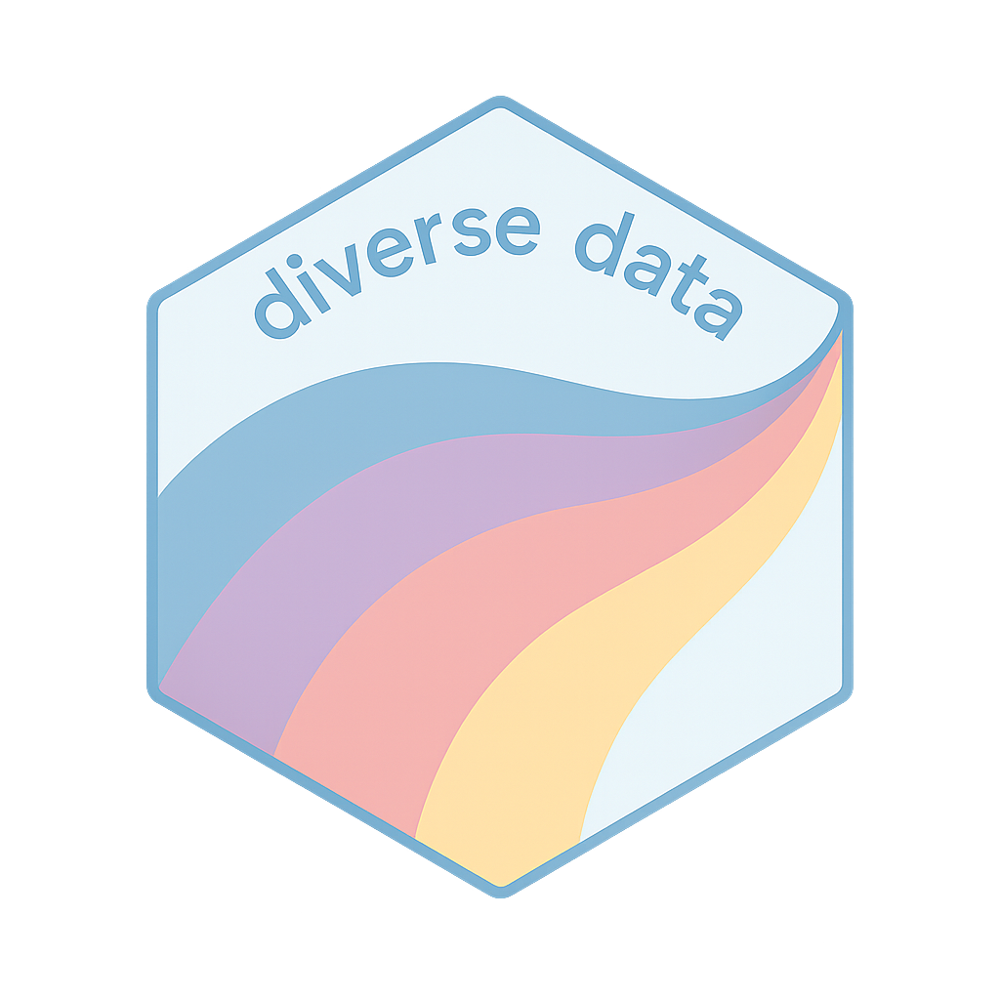

:::{.grid-container}

  
  <h3>Diverse Data Hub</h3>
  

<strong>Summary</strong>: Open educational resource offering curated data sets focused on equity, diversity, inclusion, and other socially relevant topics. It is designed to support students, educators, and researchers in accessing and working with meaningful data in their teaching, learning, and analysis.

<strong>Skills</strong>: Quarto, R, Regression, Statistics, R Packaging

<strong>UBC MDS Collaborators</strong>: Katie Burak (@katieburak), Azin Piran (@azinpiran), Siddarth Subrahmanian (@siddart1)

  <a href="https://diverse-data-hub.github.io/" class="btn btn-outline-dark">Website</a>
  <a href="https://github.com/diverse-data-hub" class="btn btn-outline-dark">Github</a>

  
  <h3>Commuting Insights</h3>
  

<strong>Summary</strong>: The dashboard visualizes commuting behavior across Canada, including transportation modes, average commute times, and regional dependencies on specific means of transport. The goal being to inform policies that can lead to better, more sustainable commuting solutions across the country.

<strong>Skills</strong>: Dash, Altair, Render.com, Python, Parquet

<strong>UBC MDS Collaborators</strong>: Eugene You (@jinxyou), Derek Rodgers (@derekrodgers), Han Wang (@hanwang205)

  <a href="https://dsci-532-2025-28-commuting-insights.onrender.com/" class="btn btn-outline-dark">Dashboard</a>
  <a href="https://github.com/UBC-MDS/DSCI-532_2025_28_commuting-insights" class="btn btn-outline-dark">Github</a>

  
  <h3>Spotify Spin Stats</h3>
  

<strong>Summary</strong>: This dashboard visualizes various aspects of music, including genres, characteristics (danceability, energy, valence, etc.), explicit content, and popularity levels of a wide variety of albums available on Spotify. This app provides insights to help music labels and emerging artists understand which musical characteristics make albums popular.

<strong>Skills</strong>: Shiny, R, ggplot2, Posit Connect Cloud

  <a href="https://0195e098-b360-07c6-5613-ec87a6dcdfe6.share.connect.posit.cloud/" class="btn btn-outline-dark">Dashboard</a>
  <a href="https://github.com/fraramfra/SpotifySongPopularity" class="btn btn-outline-dark">Github</a>

  
  <h3>py_atmosphere Package</h3>
  

<strong>Summary</strong>: This package contains the simplified [NASA's GRC Earth Atmospheric model](https://www.grc.nasa.gov/www/k-12/airplane/atmos.html) and calculates atmospheric air properties for an altitude of interest, and supports Mach number calculation for a moving object in space at the same altitude. In the context of aerospace engineering, a Standard Atmosphere model allows to calculate air properties to evaluate impact to aircraft operation.

<strong>Skills</strong>: poetry, cookiecutter, Python, pandas, pytest, Github Workflows, Continuous Development and Integration

<strong>UBC MDS Collaborators</strong>: Zhengling Jiang (@ClaireJ2100), Tianjiao Jiang (@tianjiao00).

  <a href="https://pypi.org/project/py-atmosphere-mach/" class="btn btn-outline-dark">PyPi Package</a>
  <a href="https://github.com/UBC-MDS/DSCI-532_2025_28_commuting-insights" class="btn btn-outline-dark">Github</a>

  
  <h3>Adult Income Predictor</h3>
  
 
<strong>Summary</strong>: Application of a K-Nearest Neighbors (KNN) Classifier to predict an individual's annual income based on selected categorical demographic features using the [Adult Dataset](https://archive.ics.uci.edu/dataset/2/adult). The model achieved an accuracy of approximately 80%. This result emphasizes the importance of socioeconomic factors in determining income levels.

<strong>Skills</strong>: Make, Docker, Python, pandas, pytest, pandera, KNN Classifier

<strong>UBC MDS Collaborators</strong>: Michael Suriawan (@mikem2m), Quanhua Huang (@QuanhuaHuang-ubc), Tingting Chen (@Calista321).

  <a href="img/adult_income.html" class="btn btn-outline-dark">Analysis</a>
  <a href="https://github.com/UBC-MDS/DSCI522-2425-group24_adult-income-predictor" class="btn btn-outline-dark">Github</a>

:::

Pin by Denicon from <a href="https://thenounproject.com/browse/icons/term/pin/" target="_blank" title="Pin Icons">Noun Project</a> (CC BY 3.0)

Music by Lula Sugiantoro from <a href="https://thenounproject.com/browse/icons/term/music/" target="_blank" title="Music Icons">Noun Project</a> (CC BY 3.0)

Income by nuha from <a href="https://thenounproject.com/browse/icons/term/income/" target="_blank" title="Income Icons">Noun Project</a> (CC BY 3.0)

Airplane by Ales Studio from <a href="https://thenounproject.com/browse/icons/term/airplane/" target="_blank" title="Airplane Icons">Noun Project</a> (CC BY 3.0)
